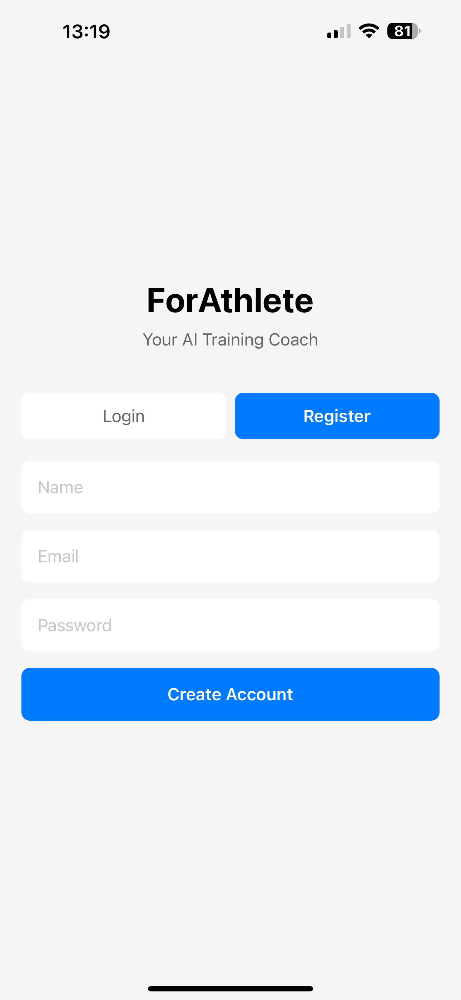
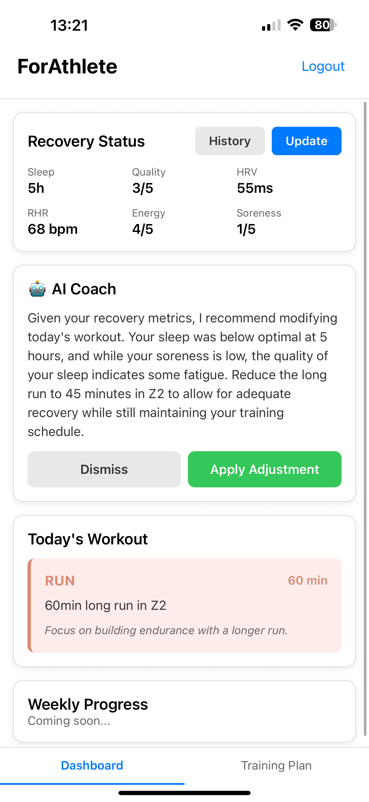
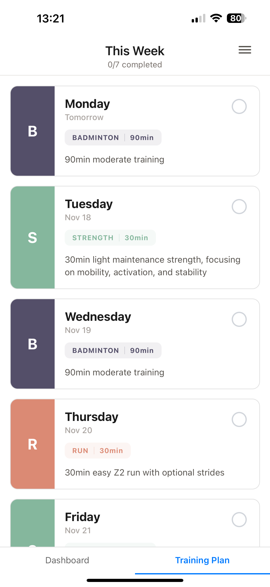
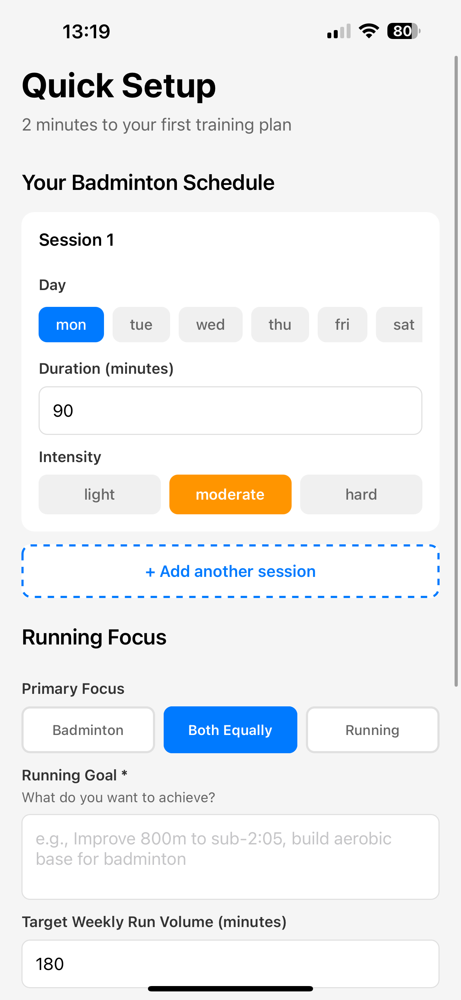
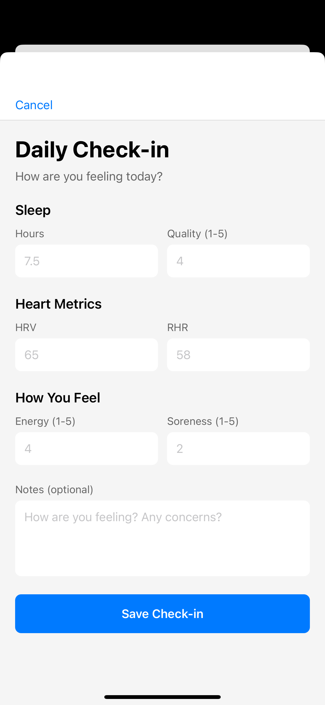
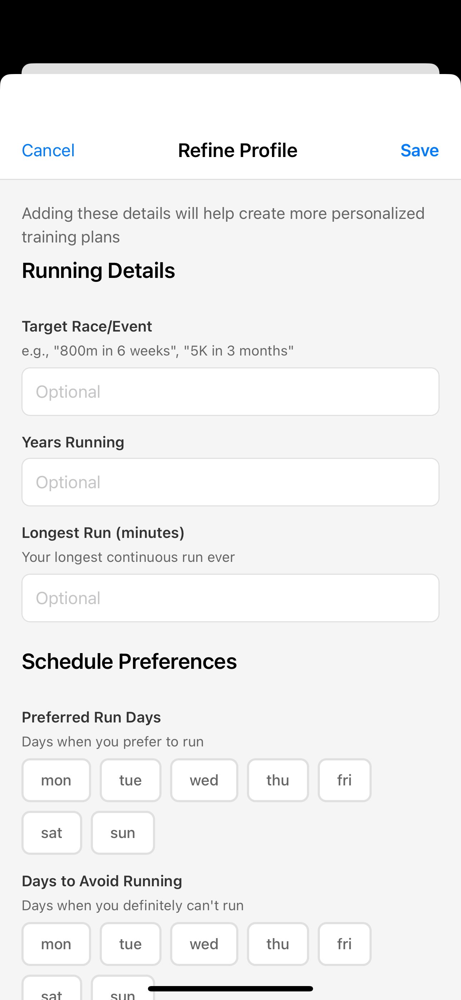

# 🏃 For4thlete

> AI-powered personalized training app for runners and badminton players

[](https://reactnative.dev/)
[](https://fastapi.tiangolo.com/)
[](https://openai.com/)

Your intelligent training companion that adapts to your daily readiness. Get personalized workouts based on sleep, recovery metrics, and training goals—reducing manual planning from hours to minutes.

<p align="center">
  
  
  
</p>

## ✨ Features

### 🤖 AI-Powered Training Plans
- **GPT-4o Integration** - Generates sport-specific, personalized training plans
- **Instant Plan Generation** - Get a full week's workout in under 30 seconds
- **Dual-Sport Support** - Specialized plans for running and badminton

### 📊 Smart Recovery Tracking
- **Daily Check-ins** - Track sleep quality, HRV, RHR, energy, and soreness
- **Adaptive Workouts** - AI adjusts training intensity based on recovery metrics
- **Real-Time Modifications** - Get workout adjustments mid-week based on fatigue

### 📱 Seamless Experience
- **Cross-Platform** - iOS and Android support with React Native
- **Offline-Ready** - Access your training plan without internet
- **Clean Interface** - Intuitive design focused on what matters

## 🎬 App Walkthrough

### 1. Quick Setup (2 minutes)


- Select your sport(s): Running, Badminton, or Both
- Set your training goals and target race/event
- Choose preferred training days and weekly volume
- AI generates your personalized plan

### 2. Daily Check-in


Track your recovery metrics:
- **Sleep** - Hours + Quality (1-5)
- **Heart Metrics** - HRV & Resting Heart Rate
- **Subjective Feel** - Energy & Soreness levels (1-5)
- **Notes** - Optional daily observations

### 3. AI Coach Recommendations


Get real-time workout adjustments:
- AI analyzes your recovery data
- Suggests modifications to today's workout
- Explains reasoning behind recommendations
- One-tap to apply or dismiss changes

### 4. Training Plan View


- **Week Overview** - See all workouts at a glance
- **Color-Coded** - Badminton (purple), Running (orange/red), Strength (green)
- **Progress Tracking** - Mark workouts as complete
- **Detailed Descriptions** - Tap any workout for full details

### 5. Profile Refinement


Fine-tune your training:
- Update target race/event
- Adjust preferred training days
- Set days to avoid running
- Modify weekly volume goals

## 🚀 How It Works
```
┌─────────────────┐
│   User Input    │
│  (Goals, Prefs) │
└────────┬────────┘
         │
         ▼
┌─────────────────┐
│   OpenAI GPT-4o │ ─── Generates personalized
│   Training Plan │     training plan in seconds
└────────┬────────┘
         │
         ▼
┌─────────────────┐
│  Daily Check-in │ ─── Sleep, HRV, RHR,
│   (Recovery)    │     Energy, Soreness
└────────┬────────┘
         │
         ▼
┌─────────────────┐
│  AI Adjustment  │ ─── Analyzes recovery data
│    Algorithm    │     Modifies workout intensity
└────────┬────────┘
         │
         ▼
┌─────────────────┐
│ Optimized Daily │
│    Workout      │
└─────────────────┘
```

## 🛠️ Tech Stack

### Frontend (Mobile)
- **Framework:** React Native (iOS & Android)
- **Navigation:** React Navigation
- **State Management:** React Context + AsyncStorage
- **UI Components:** React Native Paper
- **Icons:** Expo Vector Icons

### Backend
- **Framework:** FastAPI (Python)
- **Database:** Supabase (PostgreSQL)
- **Authentication:** Supabase Auth
- **AI:** OpenAI GPT-4o API
- **Real-time:** Supabase Realtime

### Infrastructure
- **Backend Hosting:** Railway / Render
- **Database:** Supabase Cloud
- **Mobile Build:** Expo EAS

## 📦 Installation

### Prerequisites

- Node.js 18+
- Python 3.9+
- Expo CLI (`npm install -g expo-cli`)
- Supabase account
- OpenAI API key

### Backend Setup
```bash
# Clone repository
git clone https://github.com/ChrisRobinT/for4thlete.git
cd for4thlete/backend

# Create virtual environment
python -m venv venv
source venv/bin/activate  # On Windows: venv\Scripts\activate

# Install dependencies
pip install -r requirements.txt

# Setup environment variables
cp .env.example .env
# Add your API keys to .env

# Run backend
uvicorn main:app --reload
```

### Mobile App Setup
```bash
cd ../mobile

# Install dependencies
npm install

# Setup environment variables
cp .env.example .env
# Add your Supabase and API URLs to .env

# Run on iOS
npx expo start --ios

# Run on Android
npx expo start --android
```

## 🔑 Environment Variables

### Backend `.env`
```env
OPENAI_API_KEY=sk-your-openai-key
SUPABASE_URL=https://your-project.supabase.co
SUPABASE_SERVICE_KEY=your-service-key
DATABASE_URL=postgresql://...
```

### Mobile `.env`
```env
EXPO_PUBLIC_API_URL=http://localhost:8000
EXPO_PUBLIC_SUPABASE_URL=https://your-project.supabase.co
EXPO_PUBLIC_SUPABASE_ANON_KEY=your-anon-key
```

## 🎯 Key Features Explained

### Adaptive Training Algorithm

The AI coach considers multiple factors:
```python
if sleep_hours < 6 or sleep_quality < 3:
    reduce_intensity()
    reduce_duration()
elif hrv < baseline * 0.9:
    reduce_intensity()
elif soreness > 3:
    add_recovery_day()
elif energy < 3:
    reduce_volume()
else:
    proceed_as_planned()
```

### AI Training Plan Generation

Prompt engineering for sport-specific plans:

**For Runners:**
- Zone-based training (Z2, Z3, tempo, intervals)
- Progressive overload principles
- Periodization for target race

**For Badminton:**
- Court drills (footwork, defense, attack)
- Match simulation
- Strength & conditioning specific to badminton

**Combined Plans:**
- Balanced volume allocation
- Strategic scheduling to prevent overtraining
- Complementary fitness development

## 📱 Supported Platforms

- ✅ iOS 13+
- ✅ Android 8.0+
- ⏳ Web (coming soon)

## 🚧 Roadmap

- [ ] Workout completion tracking with stats
- [ ] Integration with Strava/Garmin/Apple Health
- [ ] Social features (share workouts, compete with friends)
- [ ] Advanced analytics dashboard
- [ ] Custom exercise library
- [ ] Video demonstrations for drills
- [ ] Nutrition tracking integration
- [ ] Coach mode (for trainers to manage athletes)

## 🤝 Contributing

This is a personal project, but suggestions and feedback are welcome!

## 📝 License

This project is licensed under the MIT License - see the [LICENSE](LICENSE) file for details.

## 🙏 Acknowledgments

- [OpenAI GPT-4o](https://openai.com/) - AI-powered training plan generation
- [Supabase](https://supabase.com/) - Backend infrastructure
- [React Native](https://reactnative.dev/) - Cross-platform mobile framework
- [FastAPI](https://fastapi.tiangolo.com/) - High-performance Python backend

## 💡 The Problem It Solves

**Before For4thlete:**
- ⏰ Hours spent planning weekly training schedules
- 😓 Generic plans that don't adapt to daily readiness
- 📊 No systematic way to track recovery metrics
- 🤔 Guessing when to push hard vs. when to rest

**With For4thlete:**
- ⚡ 2-minute setup, instant personalized plan
- 🎯 Daily workout adjustments based on recovery data
- 📈 Systematic tracking of sleep, HRV, energy, soreness
- 🤖 AI coach that knows when to push and when to rest

## 👨‍💻 Author

**Chris-Robin Talts**

- GitHub: [@ChrisRobinT](https://github.com/ChrisRobinT)
- LinkedIn: [chrisrobintalts](https://linkedin.com/in/chrisrobintalts)
- Email: chrisrobin.talts@gmail.com

**Background:** Competitive badminton player and runner who got tired of spending hours planning training. Built this to automate the process while making it smarter.

---

<div align="center">

**Built for athletes who train smart, not just hard** 💪

*Reducing training plan creation from hours to minutes*

</div>
